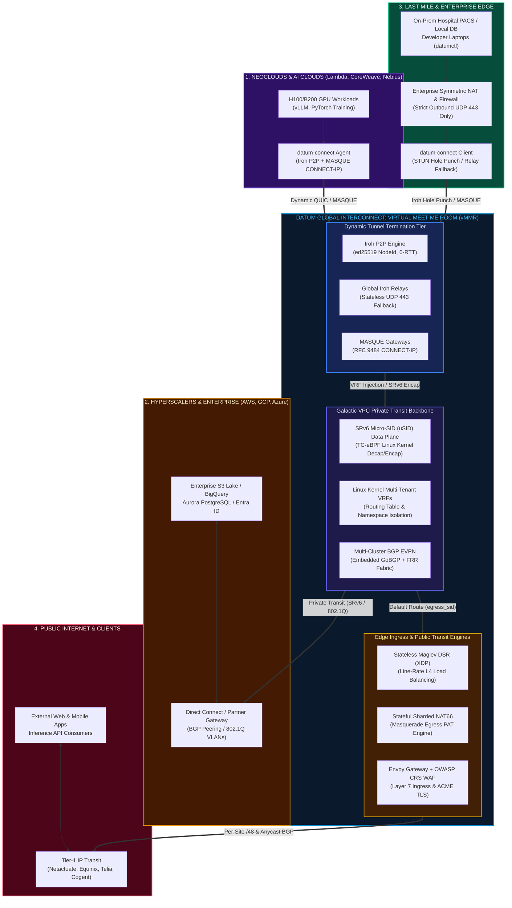
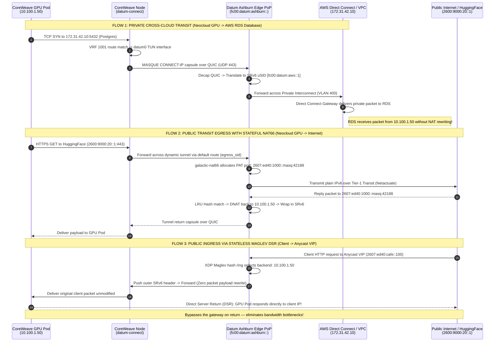

# Datum Interconnect: The Neutral Virtual Meet-Me Room (vMMR) for the AI & Multi-Cloud Era

> **A unified, software-defined interconnection platform connecting Neoclouds, Hyperscalers, and Last-Mile Providers across Dynamic Tunnels—delivering seamless Private VPC Backbones and Public Internet Transit.**

---

## Table of Contents

- [1. Executive Summary & Strategic Vision](#1-executive-summary--strategic-vision)
- [2. The Strategic Narrative: Solving the Multi-Cloud AI Networking Chasm](#2-the-strategic-narrative-solving-the-multi-cloud-ai-networking-chasm)
  - [2.1 The Traditional Meet-Me Room (MMR) & Its Failure Modes](#21-the-traditional-meet-me-room-mmr--its-failure-modes)
  - [2.2 The Three Fractured Worlds](#22-the-three-fractured-worlds)
  - [2.3 Datum's Value Proposition: "Plaid for Alt-Clouds & Hyperscalers"](#23-datums-value-proposition-plaid-for-alt-clouds--hyperscalers)
- [3. Visual Architecture & Draw.io Diagram Suite](#3-visual-architecture--drawio-diagram-suite)
  - [3.1 Accessing the Draw.io Assets](#31-accessing-the-drawio-assets)
  - [3.2 Diagram 1: Ecosystem Overview — The Virtual Meet-Me Room](#32-diagram-1-ecosystem-overview--the-virtual-meet-me-room)
  - [3.3 Diagram 2: Layered Technical Architecture & Protocol Stack](#33-diagram-2-layered-technical-architecture--protocol-stack)
  - [3.4 Diagram 3: Concrete Practical Deployment & Packet Flow Traces](#34-diagram-3-concrete-practical-deployment--packet-flow-traces)
  - [3.5 Diagram 4: Dynamic Tunnel Architecture & Agent Lifecycle](#35-diagram-4-dynamic-tunnel-architecture--agent-lifecycle)
- [4. Deep-Dive: Core Interconnect Capabilities](#4-deep-dive-core-interconnect-capabilities)
  - [4.1 Dynamic Tunnels (Iroh + IETF MASQUE Convergence)](#41-dynamic-tunnels-iroh--ietf-masque-convergence)
  - [4.2 Private Transit: The Galactic VPC Backbone (SRv6 uSID + VRF)](#42-private-transit-the-galactic-vpc-backbone-srv6-usid--vrf)
  - [4.3 High-Performance Ingress: Stateless Maglev DSR](#43-high-performance-ingress-stateless-maglev-dsr)
  - [4.4 Public Internet Transit: BGP /48 Allocations & Stateful NAT66 Egress](#44-public-internet-transit-bgp-48-allocations--stateful-nat66-egress)
- [5. Declarative Kubernetes Control Plane (CRD Model)](#5-declarative-kubernetes-control-plane-crd-model)
  - [5.1 API Resource Relationship Topology](#51-api-resource-relationship-topology)
  - [5.2 Production CRD Specifications](#52-production-crd-specifications)
- [6. Concrete Deployment Blueprint: What It Looks Like in Practice](#6-concrete-deployment-blueprint-what-it-looks-like-in-practice)
  - [6.1 Real-World Reference Scenario](#61-real-world-reference-scenario)
  - [6.2 Edge Node & Workload Deployment Steps](#62-edge-node--workload-deployment-steps)
  - [6.3 Step-by-Step Packet Traces Across the Interconnect](#63-step-by-step-packet-traces-across-the-interconnect)
- [7. Operational Reliability, Security & Zero-Trust Architecture](#7-operational-reliability-security--zero-trust-architecture)
- [8. Architectural Comparison: Datum vs. Legacy Alternatives](#8-architectural-comparison-datum-vs-legacy-alternatives)

---

## 1. Executive Summary & Strategic Vision

Modern infrastructure is undergoing a seismic shift:
1. **The Rise of the AI-Native Era**: Compute has decentralized into specialized GPU clouds (**Neoclouds** such as CoreWeave, Lambda Labs, Together AI, Nebius, RunPod, and Crusoe).
2. **Hyperscaler Data Gravity**: Core enterprise records, data lakes, and transactional storage remain anchored inside legacy **Hyperscalers** (AWS, GCP, Azure, OCI).
3. **The Edge & Last-Mile Frontier**: Real-time sensor telemetry, hospital imaging, factory automation, and local developer workstations operate at the **Last Mile**, behind strict corporate firewalls and NATs.

Connecting these three environments today requires fragile VPN overlays, expensive leased physical circuits (AWS Direct Connect, GCP Cloud Interconnect), or exposing internal microservices to the public internet across fragile CDNs.

**Datum Interconnect** provides a neutral, programmatic **Virtual Meet-Me Room (vMMR)**. Built upon open standards—including **IETF MASQUE (RFC 9484 CONNECT-IP)**, **Iroh P2P QUIC**, **Segment Routing over IPv6 (SRv6 uSID)**, **eBPF/XDP Maglev load balancing**, and **BGP EVPN**—Datum enables any node, cluster, or client to connect across dynamically provisioned, cryptographic tunnels. Workloads gain both **deterministic, isolated Private Transit** and **shielded, high-capacity Public Internet Transit** in a single unified network fabric.

```
       ┌────────────────────────────────────────────────────────┐
       │                NEOCLOUDS & AI CLOUDS                   │
       │    CoreWeave • Lambda • Nebius • Together AI • Crusoe  │
       └───────────────────────────┬────────────────────────────┘
                                   │ Dynamic QUIC / MASQUE Tunnels
                                   ▼
┌──────────────────────────────────────────────────────────────────────────────┐
│             DATUM INTERCONNECT: VIRTUAL MEET-ME ROOM (vMMR)                  │
│                                                                              │
│   ┌───────────────────────────────┐     ┌────────────────────────────────┐   │
│   │    PRIVATE TRANSIT BACKBONE   │     │    PUBLIC TRANSIT ENGINES      │   │
│   │   • Galactic SRv6 uSID Mesh   │     │   • Per-Site /48 IPv6 Transit  │   │
│   │   • Multi-Tenant Kernel VRFs  │     │   • Stateless Maglev DSR (XDP) │   │
│   │   • BGP EVPN / L3VPN Overlay  │     │   • Stateful Sharded NAT66     │   │
│   │   • Direct Server Return (DSR)│     │   • OWASP CRS WAF & ACME TLS   │   │
│   └───────────────────────────────┘     └────────────────────────────────┘   │
│                                                                              │
│         17+ Global Edge PoPs: Ashburn • Silicon Valley • Dallas •            │
│         Frankfurt • London • Amsterdam • Singapore • Tokyo • Sydney          │
└──────────────┬───────────────────────────────┬───────────────────────────────┘
               │                               │
 Dynamic QUIC  │                               │ Cloud Interconnect /
 / MASQUE      ▼                               ▼ Direct Connect
┌───────────────────────────────┐     ┌────────────────────────────────────────┐
│     LAST-MILE & ENTERPRISE    │     │      HYPERSCALER ENTERPRISE V вы       │
│  • Private On-Prem Data Centers│     │  • AWS (S3 Lakes, Aurora, IAM)         │
│  • Healthcare & Financial Edge│     │  • GCP (BigQuery, Vertex AI)           │
│  • Telco 5G MEC & Developers  │     │  • Microsoft Azure (Entra ID, O365)    │
└───────────────────────────────┘     └────────────────────────────────────────┘
```

---

## 2. The Strategic Narrative: Solving the Multi-Cloud AI Networking Chasm

### 2.1 The Traditional Meet-Me Room (MMR) & Its Failure Modes

In telecommunications, an **Internet Exchange (IX)** or **Meet-Me Room (MMR)** (such as Equinix DC2 in Ashburn or Interxion in Frankfurt) is a physical facility where telecommunications carriers, ISPs, and large tech firms physically run fiber optic cross-connects between equipment racks.

While physically sound for static backbones, physical MMRs fail the modern cloud and AI ecosystem:
- **Lead Times**: Running a cross-connect, obtaining Letters of Authorization (LOA-CFA), and provisioning BGP sessions takes **4 to 12 weeks**.
- **Prohibitive Capex & Port Costs**: Cross-connect monthly recurring charges (MRCs) plus 100Gbps cross-connect fees create an insurmountable financial barrier for emerging AI infrastructure providers.
- **Physical Boundary**: Software workloads running on serverless platforms, developer machines, or ephemeral GPU nodes in a neocloud cannot plug a physical patch cable into an MMR patch panel.

### 2.2 The Three Fractured Worlds

| Participant | Primary Workloads & Strengths | Networking Limitations & Pain Points |
| :--- | :--- | :--- |
| **Neoclouds / AI Clouds**<br/>*(CoreWeave, Lambda, Nebius, Together AI)* | Ultra-dense GPU clusters (NVIDIA H100, H200, B200), high-throughput RoCEv2/InfiniBand fabrics, agile pricing. | **Siloed Islands**: Lack proprietary global fiber backbones. High egress fees when sending inference results back to clients. No native private peering with customer clouds. |
| **Hyperscalers**<br/>*(AWS, GCP, Azure, OCI)* | Enterprise data lakes (Amazon S3, Google Cloud Storage), transactional databases (RDS, Spanner), enterprise identity (Entra ID). | **Walled Gardens**: Exorbitant data egress taxation. Proprietary interconnects (AWS Direct Connect, Azure ExpressRoute) require complex virtual interfaces (VIFs) and vendor lock-in. |
| **Last-Mile Providers & Edge**<br/>*(Enterprise On-Prem, Hospitals, Telco Edge)* | Sensitive data (HIPAA/GDPR medical imaging, proprietary factory telemetry), on-prem GPU inference nodes, developer machines. | **Symmetric NAT & Strict Firewalls**: Block inbound connections entirely. Enterprise security forbids opening port forwards. Dynamic IPs make static BGP routing impossible. |

### 2.3 Datum's Value Proposition: "Plaid for Alt-Clouds & Hyperscalers"

Just as **Plaid** moved banking interactions from batch ACH files and proprietary bank integrations to an elegant, universal developer API, **Datum moves cloud interconnection up into software**:

1. **"Go Anywhere" Software Footprint**: Rather than requiring dedicated physical networking appliances, Datum's data plane runs as lightweight, high-performance software: headless Rust agents (`datum-connect`), Go supervisors (`datumctl-connect`), and kernel eBPF/XDP drivers (`galactic-cni`, `galactic-gateway`, `galactic-router`).
2. **A Neutral "Sits in the Middle" Network**: Datum operates an open network cloud spanning 17+ major global interconnection hubs. Instead of competing with application clouds or acting as a passive CDN, Datum securely interconnects participants.
3. **Unified Transit**: One single connection provides:
   - **Private Transit**: Cryptographically isolated, line-rate L3 interconnects directly into any peer VPC.
   - **Public Transit**: High-throughput IPv4/IPv6 internet egress and DDoS-shielded ingress.

---

## 3. Visual Architecture & Draw.io Diagram Suite

### 3.1 Accessing the Draw.io Assets

The complete visual specification for Datum Interconnect is stored directly within this repository as an interactive, multi-page Draw.io document:

- **Primary Multi-Page File**: [`interconnect/datum-interconnect-architecture.drawio`](file:///home/darragh/dev/proj/datum/interconnect/datum-interconnect-architecture.drawio)
- **Individual Diagram Exports**:
  - Page 1: [`interconnect/diagrams/1-ecosystem-virtual-meet-me-room.drawio`](file:///home/darragh/dev/proj/datum/interconnect/diagrams/1-ecosystem-virtual-meet-me-room.drawio)
  - Page 2: [`interconnect/diagrams/2-control-and-data-plane-stack.drawio`](file:///home/darragh/dev/proj/datum/interconnect/diagrams/2-control-and-data-plane-stack.drawio)
  - Page 3: [`interconnect/diagrams/3-practical-deployment-and-packet-flow.drawio`](file:///home/darragh/dev/proj/datum/interconnect/diagrams/3-practical-deployment-and-packet-flow.drawio)
  - Page 4: [`interconnect/diagrams/4-dynamic-tunnel-and-agent-lifecycle.drawio`](file:///home/darragh/dev/proj/datum/interconnect/diagrams/4-dynamic-tunnel-and-agent-lifecycle.drawio)

> [!TIP]
> **How to Open and Edit:**
> 1. **VS Code**: Install the official `Hediet Draw.io Integration` extension and click directly on any `.drawio` file.
> 2. **Web**: Navigate to [app.diagrams.net](https://app.diagrams.net) and select `File > Open From > Device`.
> 3. **Desktop**: Use the native Draw.io Desktop application.

---

### 3.2 Diagram 1: Ecosystem Overview — The Virtual Meet-Me Room

This diagram illustrates how diverse participants interface with the Datum Virtual Meet-Me Room across Dynamic Tunnels.



---

### 3.3 Diagram 2: Layered Technical Architecture & Protocol Stack

This diagram breaks down the software stack from user-facing Kubernetes CRDs down to bare-metal hardware and optical interconnects.

```mermaid
graph TD
    subgraph L1["Layer 1: Workloads & User Intent"]
        W_NEO["Neocloud AI Compute Node<br/>(PyTorch, vLLM Worker)"]
        W_NIC["NetworkInterfaceClaim<br/>(Decoupled Compute NIC Request)"]
        W_HYPER["Hyperscaler App<br/>(AWS RDS Postgres, S3 Lake)"]
        W_EDGE["Edge / Local Developer<br/>(datumctl connect tunnel)"]
    end

    subgraph L2["Layer 2: Declarative Control Plane (Kubernetes CRDs)"]
        CRD_CONN["Connector & ConnectorClass<br/>(Liveness, Keys, Capabilities)"]
        CRD_AD["ConnectorAdvertisement<br/>(Exported Subnets & L4 Ports)"]
        CRD_ATTACH["ConnectorAttachment & VPC<br/>(VRF Binding & IPAM Allocation)"]
        CRD_GW["NetworkGateway & NetworkRule<br/>(VIP & Maglev DSR Rules)"]
        CRD_WAF["TrafficProtectionPolicy<br/>(OWASP CRS Paranoia Levels)"]
    end

    subgraph L3["Layer 3: Dynamic Tunnel & Connectivity (Iroh + MASQUE)"]
        T_AGENT["datum-connect Agent<br/>(Rust lib + Go supervisor)"]
        T_RELAY["Global Iroh Relay Mesh<br/>(Port 443 Fallback)"]
        T_MASQUE["IETF MASQUE Suite<br/>(RFC 9484 CONNECT-IP)"]
        T_IPAM["Dynamic IP & Route Injection<br/>(Capsule Frame Updates)"]
    end

    subgraph L4["Layer 4: High-Performance Overlay (Kernel & eBPF)"]
        K_SRV6["SRv6 Micro-SID (uSID) Engine<br/>(TC-BPF Encap/Decap in Kernel)"]
        K_VRF["Linux Kernel VRFs<br/>(Per-Tenant Cryptographic Partition)"]
        K_XDP["Stateless Maglev DSR (XDP)<br/>(Native Driver Hook, Zero-Copy LB)"]
        K_NAT["Sharded Stateful NAT66 Egress<br/>(Atomic Linear-Probe PAT)"]
    end

    subgraph L5["Layer 5: Underlay Fabric & Physical Transit"]
        U_FRR["fabric-router (FRR eBGP)<br/>(Physical Inter-Node Loopbacks)"]
        U_EVPN["GoBGP EVPN L3VPN Mesh<br/>(Fleet-Wide Route Propagation)"]
        U_BGP48["Per-Site /48 BGP Routing<br/>(Unicast IPv6 Identity per PoP)"]
        U_PHY["Physical Peering & Colocation<br/>(Equinix, Netactuate 100G/400G Links)"]
    end

    L1 --> L2
    L2 --> L3
    L3 --> L4
    L4 --> L5

    style L1 fill:#1E293B,stroke:#475569,stroke-width:2px,color:#F8FAFC
    style L2 fill:#0F172A,stroke:#0284C7,stroke-width:2px,color:#F0F9FF
    style L3 fill:#172554,stroke:#2563EB,stroke-width:2px,color:#EFF6FF
    style L4 fill:#311042,stroke:#A855F7,stroke-width:2px,color:#FAF5FF
    style L5 fill:#1C1917,stroke:#78716C,stroke-width:2px,color:#F5F5F4
```



---

### 3.4 Diagram 3: Concrete Practical Deployment & Packet Flow Traces

This diagram depicts an end-to-end practical scenario: a CoreWeave GPU cluster communicating with an AWS private PostgreSQL database and HuggingFace over public transit.



---

### 3.5 Diagram 4: Dynamic Tunnel Architecture & Agent Lifecycle

This diagram illustrates how the `datum-connect` agent initializes, traverses enterprise NATs, negotiates MASQUE tunnels, and handles seamless failover.

```mermaid
stateDiagram-v2
    [*] --> Phase1_Init: datumctl connect tunnel run

    state Phase1_Init {
        SupervisorSpawn: Go Supervisor spawns Rust datum-connect child
        KeyGen: Generate/Load Ed25519 Keypair (~/.local/share/datumctl)
        OAuth: Resolve Token via DATUM_CREDENTIALS_HELPER
        CRDBind: Reconcile Connector CRD with PublicKey details
        SupervisorSpawn --> KeyGen --> OAuth --> CRDBind
    }

    Phase1_Init --> Phase2_Traversal: Credentials & Identity Ready

    state Phase2_Traversal {
        STUNProbe: Probe local interfaces & Contact Datum Home Relay
        HolePunch: Execute Simultaneous UDP Hole Punch with Peer
        PathDecision: Evaluate Path Candidates
        DirectP2P: Upgrade to Direct 0-RTT P2P QUIC Link
        RelayFallback: Fallback to Stateless Iroh Relay on UDP 443
        STUNProbe --> HolePunch --> PathDecision
        PathDecision --> DirectP2P: Hole Punch Succeeded
        PathDecision --> RelayFallback: Symmetric / Enterprise NAT
    }

    Phase2_Traversal --> Phase3_MASQUE: QUIC Transport Established

    state Phase3_MASQUE {
        ConnectIP: Issue HTTP/3 Extended CONNECT-IP (RFC 9484)
        CapCheck: Validate Connector.spec.capabilities (CONNECT-IP, TCP)
        CapsuleAssign: Gateway returns ADDRESS_ASSIGN & ROUTE_ADVERTISEMENT
        TunAlloc: Create Virtual TUN interface (datum0) & Bind to Kernel VRF
        ConnectIP --> CapCheck --> CapsuleAssign --> TunAlloc
    }

    Phase3_MASQUE --> Phase4_Runtime: Tunnel Active & Routes Live

    state Phase4_Runtime {
        Heartbeat: Async HeartbeatAgent renews k8s coordination Lease (LeaseRef)
        TrafficForward: Forward L3 IP capsules across QUIC datagrams
        ConnMigration: Wi-Fi to Cellular handoff via QUIC Connection ID
        Heartbeat --> TrafficForward
        TrafficForward --> ConnMigration
    }

    Phase4_Runtime --> Phase2_Traversal: Path Degraded (Auto-Reconnect)
    Phase4_Runtime --> [*]: SIGTERM / Graceful Shutdown (Clean GC)
```

---

## 4. Deep-Dive: Core Interconnect Capabilities

### 4.1 Dynamic Tunnels (Iroh + IETF MASQUE Convergence)

Datum's dynamic tunneling layer combines the P2P NAT traversal capabilities of **Iroh** with the IETF standardization of **MASQUE (Multiplexed Application Substrate over QUIC Encryption)**.

```
┌─────────────────────────────────────────────────────────────────────────┐
│                        Current vs Future State                          │
│                                                                         │
│  Iroh Native Layer               IETF MASQUE Standard Layer             │
│  ├─ Best-in-class NAT hole punch ├─ RFC 9484 CONNECT-IP (L3 VPN)        │
│  ├─ Ed25519 Cryptographic NodeID ├─ RFC 9298 CONNECT-UDP (Relaying)    │
│  ├─ Global Relay Fallback        ├─ HTTP CONNECT-TCP (L4 Proxying)      │
│  └─ Custom QUIC Framing          └─ Native Browser / WebTransport Ready │
│                                                                         │
│  Convergence Advantage: Iroh provides the connectivity engine;          │
│  MASQUE provides the standards-based wire protocol.                     │
└─────────────────────────────────────────────────────────────────────────┘
```

#### Key Technical Attributes:
1. **Zero-Configuration NAT Traversal**: Enterprise edge nodes and local developer laptops rarely possess public IP addresses. Iroh's STUN discovery probes local and reflective WAN candidates, executing bidirectional hole punching.
2. **Symmetric Firewall Resilience**: When connecting through strict enterprise firewalls (which assign randomized port mappings), the agent falls back to Datum's global relay mesh over standard **UDP port 443**.
3. **Cryptographic Identity**: Tunnels are not bound to fleeting IP addresses. Every endpoint is identified by an **Ed25519 Public Key**. Mutual TLS 1.3 ensures zero man-in-the-middle attacks or BGP hijacking exposure.
4. **QUIC Connection Migration**: When an edge node shifts network interfaces (e.g., from fixed broadband to cellular backup), QUIC connection IDs ensure that **in-flight TCP/IP sessions across the MASQUE tunnel do not drop**.

---

### 4.2 Private Transit: The Galactic VPC Backbone (SRv6 uSID + VRF)

Once traffic enters a Datum Edge PoP, it is bridged into **Galactic VPC**, Datum's software-defined multi-tenant backbone.

```
Client IP Packet (Inner)            Galactic SRv6 uSID Packet (Outer)
┌────────────────────────┐         ┌──────────────────────────────────────────────┐
│ Src: 10.100.1.50       │  SRv6   │ Outer IPv6: fc00:datum:ashburn::             │
│ Dst: 172.31.42.10      │ ──────► │          ➔ fc00:datum:aws::1                 │
│ Payload (TCP 5432)     │ Bridge  │ SRH: [uSID: tenant-alpha-vrf:egress]         │
└────────────────────────┘         │ Inner Payload: [Original Client IP Packet]   │
                                   └──────────────────────────────────────────────┘
```

#### Architectural Pillars:
- **Segment Routing over IPv6 (SRv6 Micro-SID / uSID)**: Galactic replaces bloated encapsulation protocols (Geneve, VXLAN) with native IPv6 extension headers. Routing paths, service functions, and tenant identifiers are packed into compact 16-bit or 32-bit Micro-SIDs (`uSID`).
- **Kernel-Level Multi-Tenancy (VRFs)**: Isolation is enforced at the Linux kernel level via Virtual Routing and Forwarding (`VRF`) tables. Multiple tenants can utilize identical RFC 1918 private subnets (`10.0.0.0/16`) without address collision.
- **BGP EVPN Control Plane**: Embedded in `galactic-router` is an in-process **GoBGP** server. It automatically originates and distributes EVPN Type-5 IP-Prefix routes across clusters and sites over an underlay fabric managed by **FRR (`fabric-router`)**.

---

### 4.3 High-Performance Ingress: Stateless Maglev DSR

For inbound traffic (e.g., external API consumers querying an AI inference cluster), Datum uses **Stateless Maglev Direct Server Return (DSR)** implemented via native **eBPF/XDP** in `galactic-gateway`.

```
External Client                     Datum Edge Gateway                    Neocloud GPU Backend
       │                                     │                                     │
       │─── 1. Ingress Request to VIP ──────►│                                     │
       │    (Src: Client, Dst: VIP)          │                                     │
       │                                     │─── 2. Consistent Hash (Maglev) ────►│
       │                                     │    (Outer SRv6 Encap; NO NAT!)      │
       │                                     │    (Original Client IP Preserved)   │
       │                                                                           │
       │◄── 3. DIRECT SERVER RETURN (DSR) ─────────────────────────────────────────│
       │    (Worker transmits response directly to Client IP; Gateway bypassed!)
```

#### Why Maglev DSR Outperforms Traditional Load Balancers:
1. **Stateless Scalability**: Traditional load balancers maintain a stateful connection tracking table (`conntrack`). When handling millions of concurrent LLM streaming requests, state tables exhaust memory. Maglev uses a deterministic, consistent-hash permutation lookup table: any gateway node receiving a packet independently computes the identical backend target without sharing state.
2. **Zero Return Bottleneck (DSR)**: In standard reverse proxies, return traffic (which is typically 10x–100x larger than request traffic) must funnel back through the load balancer. Under Datum's DSR design, **the backend replies directly to the client**. The gateway node processes only the lightweight inbound request.
3. **True Client IP Preservation**: Because the edge gateway performs no SNAT rewriting, backend workloads see the client's genuine IP address, critical for rate limiting, geo-fencing, and audit logging.

---

### 4.4 Public Internet Transit: BGP /48 Allocations & Stateful NAT66 Egress

In addition to private multi-cloud routing, Datum Interconnect provides fully routed **Public Internet Transit**:

#### Per-Site /48 IPv6 BGP Routing
Datum allocates a dedicated `/48` IPv6 prefix to each edge location (e.g., Ashburn, Frankfurt, San Jose) advertised directly to Tier-1 upstream providers (Netactuate, Equinix, Lumen). This guarantees:
- **Global Unicast Reachability**: Services like `iroh-relay` have stable, globally routable IPv6 endpoints.
- **BGP Optimization**: Traffic destined for a specific edge PoP routes across the optimal Tier-1 path rather than bouncing unpredictably across transcontinental anycast paths.

#### Stateful Sharded NAT66 Egress
For private VPC workloads needing outbound internet access (e.g., pulling weights from HuggingFace, accessing external APIs):
- Outbound packets matching `::/0` route to the gateway's `egress_sid`.
- The `galactic-nat66` kernel tier dynamically masquerades private ULA/VPC addresses to a public Global Unicast Address (`GUA`) using an atomic, linear-probe port reservation table.
- Return traffic is automatically DNAT'd and routed back over the dynamic tunnel to the correct originating worker.

---

## 5. Declarative Kubernetes Control Plane (CRD Model)

Datum Interconnect is managed entirely through Kubernetes Custom Resources defined in the `networking.datumapis.com` API group.

### 5.1 API Resource Relationship Topology

```
┌─────────────────────────────────────────────────────────────────────────────┐
│                    Kubernetes Control Plane (Datum Cloud)                   │
│                                                                             │
│  ┌───────────────────────┐                        ┌──────────────────────┐  │
│  │       Connector       │                        │         VPC          │  │
│  │ (Client Device / Node)│                        │   (Galactic VPC)     │  │
│  └───────────┬───────────┘                        └──────────┬───────────┘  │
│              │                                               │              │
│              ▼                                               ▼              │
│  ┌───────────────────────┐                        ┌──────────────────────┐  │
│  │ ConnectorAdvertisement│                        │ ConnectorAttachment  │  │
│  │ (Exported Subnets/L4) │                        │  (Dynamic Binding)   │  │
│  └───────────────────────┘                        └──────────┬───────────┘  │
│                                                              │              │
│                                                              ▼              │
│  ┌───────────────────────┐                        ┌──────────────────────┐  │
│  │ NetworkInterfaceClaim │◄───────────────────────┤   NetworkInterface   │  │
│  │  (Compute Workload)   │   Bound by Controller  │  (NIC Facts & IPAM)  │  │
│  └───────────────────────┘                        └──────────────────────┘  │
└─────────────────────────────────────────────────────────────────────────────┘
```

### 5.2 Production CRD Specifications

#### 1. Connector Definition (`networking.datumapis.com/v1alpha1`)
Represents an external client, server, or neocloud host registering into the fabric.

```yaml
apiVersion: networking.datumapis.com/v1alpha1
kind: Connector
metadata:
  name: coreweave-gpu-cluster-01
  namespace: tenant-alpha
  annotations:
    datum.net/device-name: "neocloud-ash-h100"
spec:
  connectorClassName: datum-connect
  capabilities:
    - type: MASQUE
      connectTCP:
        disabled: false
    - type: CONNECT-IP
    - type: CONNECT-UDP
status:
  conditions:
    - type: Ready
      status: "True"
      lastTransitionTime: "2026-09-03T18:00:00Z"
  connectionDetails:
    type: PublicKey
    publicKey:
      id: 2ovpybgj3snjmchns44pfn6dbwmdiu4ogfd66xyu72ghexllv6hq
      homeRelay: https://relay.ash.datum.net
  leaseRef:
    name: connector-lease-coreweave-gpu-cluster-01
    namespace: tenant-alpha
```

#### 2. ConnectorAttachment (`networking.datumapis.com/v1alpha1`)
Attaches the connector to an isolated Galactic VPC with dynamic IP allocation and route authorization.

```yaml
apiVersion: networking.datumapis.com/v1alpha1
kind: ConnectorAttachment
metadata:
  name: attach-coreweave-to-production-vpc
  namespace: tenant-alpha
spec:
  connectorRef:
    name: coreweave-gpu-cluster-01
  vpcRef:
    name: production-vpc
  ipAllocation:
    mode: Dynamic
  allowedRoutes:
    - 172.31.0.0/16      # AWS VPC Private Subnets
    - 10.200.0.0/16      # On-Premises Healthcare Datacenter
    - ::/0               # Public Internet Egress via NAT66
status:
  phase: Connected
  assignedIP: 10.100.1.50
```

#### 3. ConnectorAdvertisement (`networking.datumapis.com/v1alpha1`)
Advertises reachable subnets or Layer 4 endpoints hosted behind the connector.

```yaml
apiVersion: networking.datumapis.com/v1alpha1
kind: ConnectorAdvertisement
metadata:
  name: advertise-coreweave-vllm
  namespace: tenant-alpha
spec:
  connectorRef:
    name: coreweave-gpu-cluster-01
  subnets:
    - cidr: 10.100.1.0/24
  layer4:
    - protocol: TCP
      service:
        name: vllm-api
        port: 8000
        address: 10.100.1.50
```

#### 4. NetworkInterfaceClaim & NetworkInterface (`networking.datumapis.com/v1alpha`)
Decouples compute instances from networking internals, ensuring retained IP identity across pod restarts.

```yaml
apiVersion: networking.datumapis.com/v1alpha
kind: NetworkInterfaceClaim
metadata:
  name: vllm-worker-nic-claim
  namespace: tenant-alpha
spec:
  networkRef:
    name: production-vpc
---
apiVersion: networking.datumapis.com/v1alpha
kind: NetworkInterface
metadata:
  name: vllm-worker-nic-claim-nic
  namespace: tenant-alpha
status:
  phase: Bound
  addresses:
    - ip: 10.100.1.50/24
    - ip: fd00:datum:tenant1::50/64
  gateway: 10.100.1.1
  mtu: 1500
```

#### 5. NetworkGateway & NetworkRule (`networking.datumapis.com/v1alpha`)
Configures the edge XDP Maglev DSR load-balancing ingress.

```yaml
apiVersion: networking.datumapis.com/v1alpha
kind: NetworkGateway
metadata:
  name: global-api-gateway
  namespace: tenant-alpha
spec:
  publicInterface: eth0
status:
  anycastVIP: 2607:ed40:cafe::100
  srv6Address: fc00:datum:ashburn::gateway-01
---
apiVersion: networking.datumapis.com/v1alpha
kind: NetworkRule
metadata:
  name: vllm-ingress-rule
  namespace: tenant-alpha
spec:
  gatewayRef:
    name: global-api-gateway
  protocol: TCP
  port: 443
  targetBackendPort: 8000
  vpcRef:
    name: production-vpc
  backends:
    - ip: 10.100.1.50
      weight: 100
```

---

## 6. Concrete Deployment Blueprint: What It Looks Like in Practice

### 6.1 Real-World Reference Scenario

An AI startup has deployed:
1. **Neocloud**: CoreWeave cluster running 512x NVIDIA H100 GPUs running distributed vLLM model inference (`10.100.1.0/24`).
2. **Hyperscaler**: AWS `us-east-1` VPC hosting production PostgreSQL databases (`172.31.42.10`) and Amazon S3 checkpoint buckets.
3. **Last-Mile Provider**: An on-premises enterprise data center (`10.200.0.0/16`) streaming raw proprietary documents to the GPU cluster for fine-tuning.

### 6.2 Edge Node & Workload Deployment Steps

#### Step 1: Install the Datum Connect CLI & Plugin
On the Neocloud GPU host / VM:

```bash
# 1. Install datumctl
curl -sSL https://get.datum.net | bash

# 2. Install the Datum Connect plugin (downloads Go supervisor + Rust engine)
datumctl plugin install datum-cloud/connect

# Binaries installed to ~/.datumctl/plugins:
# - datumctl-connect (Go supervisor)
# - datum-connect (Rust headless Iroh + MASQUE engine)
```

#### Step 2: Launch the Dynamic Tunnel Daemon

```bash
# Run the tunnel supervisor in the background
datumctl connect tunnel run \
  --project-id "prj_tenant_alpha" \
  --name "coreweave-gpu-cluster-01" \
  --vpc "production-vpc" \
  --export-subnet "10.100.1.0/24" \
  --daemon
```

#### Step 3: Production Systemd Service Unit
For automated host persistence, `datumctl` generates a standard systemd service:

```ini
# /etc/systemd/system/datum-connect.service
[Unit]
Description=Datum Connect Dynamic Tunnel Daemon
After=network.target network-online.target
Wants=network-online.target

[Service]
Type=simple
User=datum
Group=datum
WorkingDirectory=/var/lib/datum
ExecStart=/usr/local/bin/datumctl-connect tunnel run \
  --project-id prj_tenant_alpha \
  --name coreweave-gpu-cluster-01 \
  --vpc production-vpc \
  --log-dir /var/log/datum
Restart=always
RestartSec=5s
LimitNOFILE=65536
Environment="DATUM_CREDENTIALS_HELPER=/usr/local/bin/datum-token-helper"

[Install]
WantedBy=multi-user.target
```

```bash
systemctl daemon-reload
systemctl enable --now datum-connect
```

#### Step 4: Verify Tunnel Health & Kernel VRF Status

```bash
datumctl connect tunnel list
```

**Console Output:**
```text
ID         NAME                      STATUS   MODE       LOCAL IP       ASSIGNED VIP     PEER RELAY
tun_98a1   coreweave-gpu-cluster-01  READY    MASQUE/P2P 198.51.100.22  10.100.1.50/24   relay.ash.datum.net
```

```bash
# Check kernel VRF routing table
ip route show vrf vrf-tenant-alpha
```
```text
default via 10.100.1.1 dev datum0 proto datum
172.31.0.0/16 via 10.100.1.1 dev datum0 proto datum
10.200.0.0/16 via 10.100.1.1 dev datum0 proto datum
```

---

### 6.3 Step-by-Step Packet Traces Across the Interconnect

#### Flow A: Private Cross-Cloud Transit (Neocloud GPU ➔ AWS RDS Database)
1. **Application Socket**: PyTorch worker on CoreWeave initiates TCP handshake to `172.31.42.10:5432` (AWS RDS).
2. **VRF Route Match**: Host kernel identifies destination within `172.31.0.0/16`; directs packet to virtual interface `datum0`.
3. **MASQUE Encapsulation**: `datum-connect` encapsulates packet into an RFC 9484 `CONNECT-IP` capsule frame, transported inside an encrypted QUIC datagram (UDP 443) to Datum Ashburn Edge PoP.
4. **SRv6 uSID Translation**: The PoP ingress gateway decapsulates the QUIC datagram and prepends an outer IPv6 Segment Routing header:
   ```text
   Outer IPv6 Header:
     Src: fc00:datum:ashburn::gateway-01
     Dst: fc00:datum:aws::direct-connect-01
     SRH: [uSID: tenant-alpha-vrf-1001]
   Inner Packet:
     Src: 10.100.1.50
     Dst: 172.31.42.10
   ```
5. **Backbone Optical Transit**: Packet traverses Datum's private fiber underlay over eBGP routing fabric (`fabric-router`).
6. **Delivery to AWS**: Datum's AWS Interconnect Gateway strips the outer SRv6 header and transmits the raw IP packet across the Direct Connect 802.1Q VLAN trunk.
7. **Database Response**: PostgreSQL receives a clean packet originating directly from `10.100.1.50`. No NAT rewriting occurs.

#### Flow B: Public Internet Egress (Neocloud GPU ➔ HuggingFace Model Hub)
1. **Outbound Request**: GPU worker queries `2600:9000:20::1` (HuggingFace Hub) over HTTPS port 443.
2. **Default Route Match**: Packet matches `::/0` default route; routed over the dynamic tunnel to Datum Edge PoP matching `egress_sid`.
3. **Stateful NAT66 Masquerade**: Datum's `galactic-nat66` kernel engine:
   - Allocates an ephemeral source port from its LRU connection table.
   - Translates source IP to the PoP's publicly routable IPv6 address: `2607:ed40:1000::masq:42188`.
4. **Internet Transit**: Packet leaves Datum's uplink via Netactuate / Equinix Tier-1 IP Transit.
5. **Return Path**: HuggingFace replies to `2607:ed40:1000::masq:42188`. The edge gateway looks up the LRU table row, restores destination to `10.100.1.50`, encapsulates into SRv6/MASQUE, and routes back to the CoreWeave host.

#### Flow C: Public Ingress via Stateless Maglev DSR (External Consumer ➔ Neocloud API)
1. **Client Request**: End user connects to Datum Anycast VIP: `2607:ed40:cafe::100:443`.
2. **Edge Ingress**: Anycast routes packet to the closest Datum Edge PoP (e.g., Ashburn).
3. **XDP Maglev Hashing**: The native eBPF XDP hook in `galactic-gateway` hashes the packet's 5-tuple into its Maglev lookup table, selecting backend `10.100.1.50`.
4. **SRv6 Encapsulation (No NAT)**: Gateway pushes an outer SRv6 header addressed to the backend's uSID. **Neither the client IP nor the payload is modified**.
5. **Direct Server Return (DSR)**: The CoreWeave GPU Pod receives the request and generates the HTTP response. Crucially, **the backend transmits the reply directly back to the client's public IP address** via Datum public transit egress. The gateway is completely bypassed on return, preventing gateway link saturation!

---

## 7. Operational Reliability, Security & Zero-Trust Architecture

### 7.1 Cryptographic Identity & Zero Inbound Ports
- **Ed25519 Mutual Authentication**: Traditional IPsec preshared keys (PSKs) and static IP ACLs are eliminated. Every node authenticates with asymmetric Ed25519 keypairs.
- **Fail-Closed Firewall Posture**: Edge nodes require **zero open inbound ports** (`LISTEN`). All tunnels originate outbound over UDP port 443, bypassing stateful enterprise inspection devices.

### 7.2 Liveness & Failure Recovery (LeaseRef)
- **Kubernetes Lease Renewal**: The Rust tunnel agent runs an asynchronous `HeartbeatAgent` that continuously renews a `coordination.k8s.io/v1 Lease` object recorded in `Connector.status.leaseRef`.
- **Sub-Second Failover**: If an edge node crashes or loses connectivity, its lease expires. The `ConnectorReconciler` marks the connector `Ready: False`. Galactic BGP withdraws the associated EVPN routes within 500ms, preventing traffic blackholing.

### 7.3 Layer 7 Ingress Protection (OWASP CRS ModSecurity WAF)
For public-facing ingress endpoints, Datum integrates Envoy Gateway with OWASP Core Rule Set (CRS) protection via `TrafficProtectionPolicy`:
- **SQL Injection (SQLi) & Remote Code Execution (RCE) Filtering**
- **Adaptive Rate Limiting & DDoS Shielding**
- **Automated TLS Certificate Lifecycle** via Let's Encrypt / ACME integration

---

## 8. Architectural Comparison: Datum vs. Legacy Alternatives

| Feature / Dimension | Traditional Telco MPLS / Leased Lines | Hyperscaler Cloud Interconnects (DirectConnect / ExpressRoute) | P2P Mesh VPN Overlays (Tailscale / ZeroTier) | Datum Interconnect (vMMR) |
| :--- | :--- | :--- | :--- | :--- |
| **Provisioning Lead Time** | 30–90 Days (Physical circuits) | 14–30 Days (LOA-CFA + Cross-connects) | Minutes (Software client) | **Instantaneous (Declarative CRDs + CLI)** |
| **Neocloud / Alt-Cloud Peering** | ❌ None (Requires colocation cage) | ❌ None (Locked to hyperscaler VPC) | ⚠️ Unmanaged P2P (No BGP / No SLA) | ** Native (Full L3/L4 Peering & SRv6 Backbone)** |
| **Data Plane Performance** | High (Dedicated optical) | High (Dedicated 10G/100G) | Moderate (Kernel context switching) | **Line-Rate (Native eBPF/XDP + SRv6 uSID)** |
| **Transit Modality** | Private Only | Private Only | Private Only | **Unified Private Transit + Public Internet Transit** |
| **Ingress Load Balancing** | External Appliance (F5, NetScaler) | Hyperscaler ALB/NLB (High cost) | None (Point-to-point only) | **Stateless Maglev DSR in eBPF/XDP** |
| **Firewall & NAT Traversal** | ❌ Fails (Requires static public IPs) | ❌ Fails (Requires dedicated VLANs) |  Good (STUN / DERP relays) | ** Best-in-Class (Iroh P2P + MASQUE UDP 443)** |
| **Public Transit Egress** | ❌ Separate ISP contract needed | ❌ Expensive hyperscaler egress tax | ❌ Exit nodes bottlenecked | ** Sharded Stateful NAT66 via Tier-1 Backbones** |
| **Multi-Tenant Isolation** | MPLS L3VPN (Complex PE/P routers) | Proprietary VPC Peering / TGW | Network ACLs | **Hardware-Grade Linux Kernel VRF + BGP EVPN** |

---

## Summary & Next Steps

Datum Interconnect redefines cloud networking by replacing physical patch panels and vendor-locked circuits with a high-performance, cryptographic software fabric. Whether interconnecting multi-thousand GPU clusters across Neoclouds, federating enterprise datasets from Hyperscalers, or streaming real-time edge telemetry from the Last Mile, Datum provides a unified, programmable home for modern distributed systems.

### Related Documentation & Code References
- **Multi-Page Architecture Diagram**: [`interconnect/datum-interconnect-architecture.drawio`](file:///home/darragh/dev/proj/datum/interconnect/datum-interconnect-architecture.drawio)
- **Datum Connect Daemon Source**: [`datum-connect-daemon/connect/`](file:///home/darragh/dev/proj/datum/datum-connect-daemon/connect/)
- **Galactic SRv6 & Gateway Data Plane**: [`galactic/`](file:///home/darragh/dev/proj/datum/galactic/)
- **Network Services Operator CRDs**: [`network-services-operator/`](file:///home/darragh/dev/proj/datum/network-services-operator/)
- **Datum Website Product Specification**: [`datum.net-website/src/pages/platform/connect.astro`](file:///home/darragh/dev/proj/datum/datum.net-website/src/pages/platform/connect.astro)
